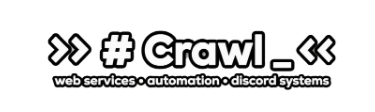
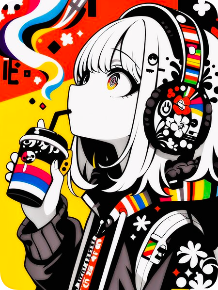



  

  

  <h2> / ABOUT ME / </h2>

- 커뮤니티 운영을 위한 **Discord 봇과 자동화 도구**를 개발
- **TypeScript · Node.js** 기반 명령 처리와 서버 연동 기능을 구현
- **React · Next.js** 기반 반응형 웹사이트를 제작하고 배포
- 다국어, 테마 전환, 데이터 기반 UI와 스크롤 모션을 구현
- **Ubuntu VPS · PM2 · DNS** 환경에서 서비스를 배포하고 운영
- **바이너리 분석 · YARA · PE 분석**을 자체 샘플로 문서화

<h2> / CURRENT SKILLS / </h2>

<h4> core languages </h4>

  
  
  
  
  
  

<h4> backend & bot development </h4>

  
  
  
  

<h4> web development </h4>

  
  
  
  

<h4> deployment & operations </h4>

  
  
  
  
  

<h4> security & binary analysis </h4>

  
  
  
  

  

  

    <a href="https://discord.com/">ANYTALK</a>
  

  
  

 

<h2 align="center"> / FEATURED WORK / </h2>

<table width="100%">
  <tr>
    <th align="left" width="24%">Project</th>
    <th align="left" width="50%">Overview</th>
    <th align="left" width="26%">Stack</th>
  </tr>

  <tr>
    <td valign="top">
      <a href="https://github.com/bongmyung-ye/nexora-corporate-web">
        <b>Nexora Corporate Web</b>
      </a>
    </td>
    <td valign="top">
      기업형 콘텐츠 흐름을 직접 설계한 반응형 웹사이트입니다. 
      다국어, 테마 전환, 투자 차트, 기술 파트너 UI와 푸터 네트워크 모션을 구현했습니다.
    </td>
    <td valign="top">
      <b>React</b> 
      TypeScript · Vite 
      CSS · i18next
    </td>
  </tr>

  <tr>
    <td valign="top">
      <a href="https://github.com/bongmyung-ye/discord-tempvoice-app">
        <b>Discord TempVoice App</b>
      </a>
    </td>
    <td valign="top">
      임시 음성 채널의 생성과 관리를 자동화하는 Discord 애플리케이션입니다. 
      명령어, 버튼, 모달, 소유권 이전과 채널 제어 흐름을 구현했습니다.
    </td>
    <td valign="top">
      <b>TypeScript</b> 
      Discord.js 
      Node.js
    </td>
  </tr>

  <tr>
    <td valign="top">
      <a href="https://github.com/bongmyung-ye/binary-analysis-lab">
        <b>Binary Analysis Lab</b>
      </a>
    </td>
    <td valign="top">
      직접 제작한 안전한 Windows 샘플을 기반으로 진행한 바이너리 분석 프로젝트입니다. 
      PE 분석, YARA 룰, 해시 검증과 보조 스크립트를 문서화했습니다.
    </td>
    <td valign="top">
      <b>C · Python</b> 
      YARA 
      PE Analysis
    </td>
  </tr>
</table>

 

<h2 align="center"> / DEVELOPMENT ACTIVITY / </h2>

  

---

Last Edited on: 07/14/2026
