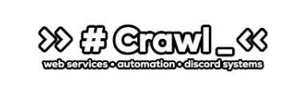
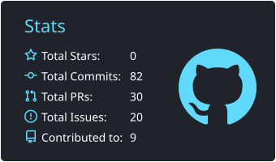
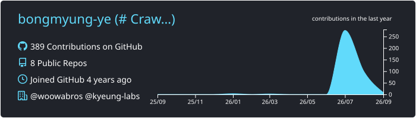

<table
  width="100%"
  align="center"
  style="width: 100%; table-layout: fixed;"
>
  <tr>
    <td width="62%" valign="top">
      

        
      

      <blockquote>
        

          <b>React · Next.js</b> 기반 프론트엔드부터
          <b>TypeScript · Node.js</b> 기반 백엔드와 API,
          <b>PostgreSQL · MongoDB</b>를 활용한 데이터 처리,
          Discord 봇과 자동화, React Native 모바일 기능,
          Ubuntu VPS 환경의 배포·운영까지 서비스 전반을 직접 설계하고 구현합니다.
        

      </blockquote>
       
      

        <b>CORE STACK</b>
          
        
        
        
        
        
        
      

    </td>
    <td width="38%" valign="middle" align="center">
      
    </td>
  </tr>
</table>

 

  

  
  

 

<table
  width="100%"
  align="center"
  style="width: 100%; table-layout: fixed;"
>
  <tr>
    <th align="left" width="24%">Project</th>
    <th align="left" width="50%">Overview</th>
    <th align="left" width="26%">Stack</th>
  </tr>

  <tr>
    <td valign="top">
      <a href="https://github.com/bongmyung-ye/link-discord-platform">
        <b>디스코드 LINK 봇</b>
      </a>
       
      <a href="https://link-app.xyz">link-app.xyz</a>
    </td>
    <td valign="top">
      Discord 서버의 활동 데이터를 수집하고 운영 현황을 웹 대시보드에서 관리할 수 있도록 구성한 통계·레벨링 플랫폼입니다.
       
      Discord 로그인, 서버별 관리 화면, 메시지·음성 활동 집계, 레벨 기반 역할 보상과 역할 설정 흐름을 구현했습니다.
    </td>
    <td valign="top">
      <b>TypeScript</b>
       
      Discord.js · Next.js
       
      PostgreSQL · Prisma
    </td>
  </tr>

  <tr>
    <td valign="top">
      <a href="https://github.com/bongmyung-ye/delivery-dispatch-platform">
        <b>배달 대행 플랫폼</b>
      </a>
    </td>
    <td valign="top">
      라이더, 관제, 상점이 하나의 주문·배차 흐름을 사용할 수 있도록 구성한 배달 플랫폼 앱입니다.
       
      주문 접수, 배차 관리, 운행 상태 전환, 배달 진행 상황과 정산 정보를 각 앱의 역할에 맞게 구현했습니다.
    </td>
    <td valign="top">
      <b>React Native</b>
       
      TypeScript · Android
       
      Jest
    </td>
  </tr>

  <tr>
    <td valign="top">
      <a href="https://github.com/bongmyung-ye/nexora-corporate-web">
        <b>가상 기업 넥소라 웹</b>
      </a>
    </td>
    <td valign="top">
      기업형 콘텐츠 흐름을 직접 설계한 반응형 웹사이트입니다.
       
      다국어, 테마 전환, 투자 차트, 기술 파트너 UI와 푸터 네트워크 모션을 구현했습니다.
    </td>
    <td valign="top">
      <b>React</b>
       
      TypeScript · Vite
       
      CSS · i18next
    </td>
  </tr>

  <tr>
    <td valign="top">
      <a href="https://github.com/bongmyung-ye/discord-tempvoice-app">
        <b>Discord TempVoice App</b>
      </a>
    </td>
    <td valign="top">
      임시 음성 채널의 생성과 관리를 자동화하는 Discord 애플리케이션입니다.
       
      명령어, 버튼, 모달, 소유권 이전과 채널 제어 흐름을 구현했습니다.
    </td>
    <td valign="top">
      <b>TypeScript</b>
       
      Discord.js
       
      Node.js
    </td>
  </tr>

  <tr>
    <td valign="top">
      <a href="https://github.com/bongmyung-ye/binary-analysis-lab">
        <b>Binary Analysis Lab</b>
      </a>
    </td>
    <td valign="top">
      직접 제작한 안전한 Windows 샘플을 기반으로 진행한 바이너리 분석 프로젝트입니다.
       
      PE 분석, YARA 룰, 해시 검증과 보조 스크립트를 문서화했습니다.
    </td>
    <td valign="top">
      <b>C · Python</b>
       
      YARA
       
      PE Analysis
    </td>
  </tr>
</table>

 

